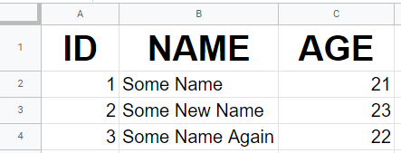

# Excel-ent

[](https://www.npmjs.com/package/excel-ent)
[](https://github.com/leoreisdias/excel-ent/blob/main/LICENSE)

## Description

[excel-ent](https://github.com/leoreisdias/excel-ent.git) is a helper lib to export data in XLS and CSV.

## Installation

```bash
$ yarn add excel-ent

# or with npm

$ npm install excel-ent --save
```

## Using excel-ent

Two main functions <b>exportmeExcel</b> & <b>exportmeToCsv</b> 

### exportmeExcel

exportmeExcel(data: any[], title: string, options?: CSS.Properties)

#### Parameters

`data`
Required, must be an array of Object

`title`
Required, name of the archive generated

`options`
Optional, receives two attributes: <i>bodyStyle</i> and <i>headerStyle</i>

- `bodyStyle` and `headerStyle`: Both receives CSS Properties in <b>camelCase</b> and provide style for the header and body in the Excel File

### Example

```js
import { exportmeExcel } from "excel-ent";

const data = [
  {
    id: 1,
    name: 'Some Name',
    age: 21,
  },
  {
    id: 2,
    name: 'Some New Name',
    age: 23,
  },
  {
    id: 3,
    name: 'Some Name Again',
    age: 22,
  },
];

exportmeExcel(data, 'test', {
  bodyStyle: { fontSize: '20px' },
  headerStyle: { fontSize: '40px' },
});

```

### Example output


---

### exportmeToCsv

exportmeToCsv(data: any[], title: string)

### Parameters

`data`
Required, must be an array of Object

`title`
Required, name of the archive generated

### Example

```js
import { exportmeToCsv } from "excel-ent";

const data = [
  {
    id: 1,
    name: "Some Name",
    age: 21,
  },
  {
    id: 2,
    name: "Some New Name",
    age: 23,
  },
  {
    id: 3,
    name: "Some Name Again",
    age: 22,
  },
];

exportmeToCSV(data, "MyReport");

```

---

## License

excel-ent is [MIT licensed](LICENSE).

---

## Thank you and be free to contribute.
